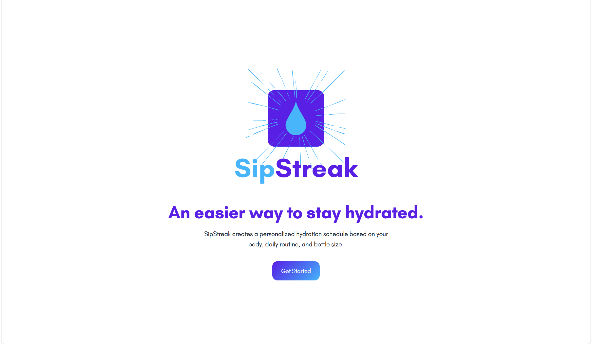

# SipStreak 💧

**An easier way to stay hydrated.**



SipStreak is a lightweight browser-based hydration tracker that builds a personalized water schedule based on your body and daily routine — no account, no app store, no setup.

---

## How It Works

1. Enter your name, biological sex, and weight
2. Set your wake-up and sleep times
3. Enter your water bottle size
4. SipStreak calculates your daily water goal and generates an evenly-spaced drinking schedule
5. Check off bottles throughout the day and track your progress on the dashboard

---

## Features

- Personalized daily water goal based on weight and sex
- Auto-generated hydration schedule fitted to your waking hours
- Visual progress ring that updates as you check off bottles
- Saves your plan to the browser so progress persists on refresh
- Smooth animated onboarding flow
- Fully responsive for mobile and desktop

---

## Tech Stack

- HTML, CSS, JavaScript — no frameworks, no dependencies
- Browser `localStorage` for data persistence

---

## Getting Started

Just open `index.html` in a browser. No install or build step required.

```bash
git clone https://github.com/yourname/sipstreak.git
cd sipstreak
open index.html
```